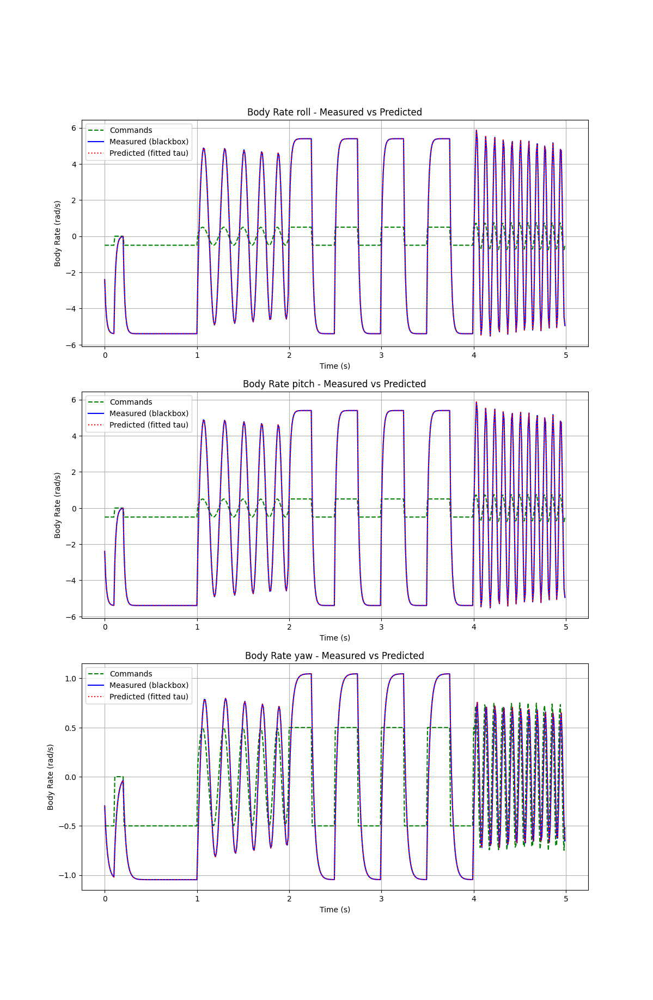
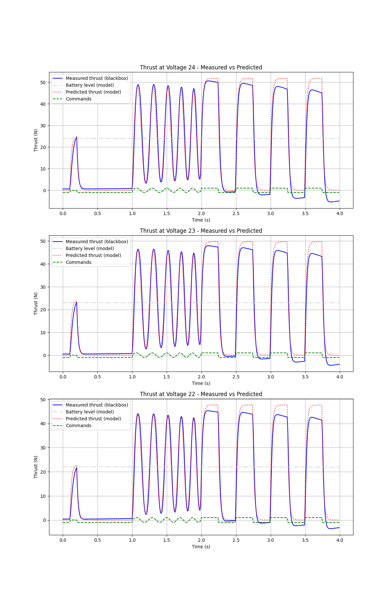
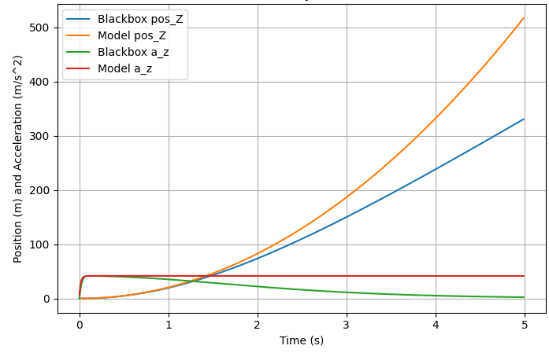
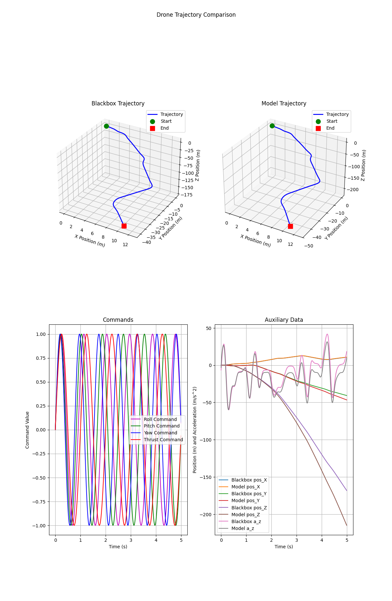

# Drone Racing RL Project

## Task 1: Modeling of Environment Dynamics

### Model

The [model](model.py) is implementing slightly simplified dynamics of the blackbox drone model.
One assumption is, that we can ignore aerodynamic drag. However, this may lead to differences when the drone reaches high velocities. To make this
assumption hold while generating the data, the velocity of the models is reset, once it reaches 20 m/s.
Addidionally, the thrust approximation is done under the assumption of purely vertical movement.
The Battery is modeled to decrease by 1 Volt every 60 seconds.

### Identification Procedure

The system identification is done in [acro_excite.py](acro_excite.py) by first exciting the blackbox model with a dirac pulse, steps and a sine wave 
in the range from -1 to 1 for each element of the action commands individually. This model response generation is done in the `excite_model` function,
which can be used on the blackbox or our model.
The blackbox response is then used as reference for fitting the tau values and thrust coefficients.

The tau values for roll, pitch and yaw are fitted using a linear regression approach implemented in the function `fit_tau`.

For thrust coefficient fitting we implemented a least squares algorithm to find fitting coefficients for the given thrust polynomial.
Using the mean tau from the other axes for the thrust tau helped improve the results.
(Sadly, the message on tuwel, that it's hard to get good results without using scipy's least squares, came too late for us...)

### Validation results

For validation of the results, another set of commands is used that also include a pulse, steps and sine waves with changing frequency for the
different components of the commands.

Plotting the results of exciting the roll, pitch and yaw axis for the blackbox and our model for the validation command sequence results in the 
following diagram:

Plotting the results of exciting thrust for different voltages yields the following diagram:

The **one step prediction mean square error** for these signals is:

|                   | roll       | pitch      | yaw        | thrust      |
|-------------------|------------|------------|------------|-------------|
| MSE Position:     | 0.00000001 | 0.00000001 | 0.00000001 | 0.00000001  |
| MSE Velocity:     | 0.00032150 | 0.00031744 | 0.00030133 | 0.00044554  |
| MSE Acceleration: | 3.21503377 | 3.17442513 | 3.01326990 | 4.45537949  |
| MSE Quaternion:   | 0.00000000 | 0.00000000 | 0.00000000 | 0.00000000  |
| MSE Body Rates:   | 0.00000000 | 0.00000000 | 0.00000000 | 0.00000000  |
| MSE Thrust:       | 9.58668518 | 9.46389008 | 9.03981018 | 13.36613655 |    

Here we can already see, that the acceleration/thrust modelling seems to have issues.
We can see a clear influence of drag even for short simulations, as depicted in the following diagram for a constant thrust command of 1 and all body rates commands set to 0.

Finally, a short 3D trajectory is generated using sine waves on all command axes simultaneously (with different frequencies) to verify that the
overall behaviour is plausible when compared to the blackbox.

### Usage
`python acro_excite.py`
This collects the data from the blackbox for the training/learning and valitation/test command sequences and runs the fitting algorithms on the model.
The plots for this report can also be shown by setting the `do_plot` variable to `True`.

## Task 2: Visualization of Rollouts with Rerun

For Task 2, we implemented a visualization tool using the Rerun logging framework to inspect drone racing rollouts in both 3D space and time-synchronized plots.

The core of the implementation is the function `visualize_state_action_sequence(sequence, gates, recording_path, app_id)`, which takes a rollout as a list of state–action pairs `(x, u)` and exports a `.rrd` recording. Each state `x` follows the provided 21-dimensional layout (position, velocity, acceleration, orientation quaternion, angular velocity, previous action, battery voltage), and each action `u` is a 4-dimensional normalized control command.

### Visualization design

The visualization is structured into static and dynamic components:

**Static scene elements (logged once):**
- A world coordinate frame using a right-handed, Z-up convention.
- Racing gate geometry constructed from the provided gate centers and orientations. Each gate is visualized as an outer and inner rectangular loop in 3D space.
- The full drone trajectory, visualized as a polyline connecting all position samples from the rollout.

**Dynamic elements (logged per timestep):**
- The drone pose over time, including motor positions, X-shaped arms, and a forward camera ray, derived from the drone’s position and orientation.
- Time-synchronized scalar plots for key quantities:
  - translational speed,
  - angular speed,
  - individual action components (roll, pitch, yaw, thrust),
  - Euler angles (roll, pitch, yaw).

A discrete time axis (`step`) is used to synchronize all spatial and scalar data, allowing smooth playback and frame-by-frame inspection in the Rerun viewer. An additional continuous time axis (`sim_time`) is logged using the simulator timestep (`dt = 0.01 s`).

### Usage

A small demo script is included via a `__main__` block. It loads an example rollout stored in a `.npy` file, converts it into the required `(x, u)` sequence format, and writes the visualization to `rollout.rrd`. The resulting file can be opened in the Rerun viewer to analyze drone motion, control behavior, and stability over time.

### Purpose

This visualization tool was used extensively to debug and analyze policies in Task 3. In particular, it helped identify issues such as unstable control, incorrect orientation handling, and inefficient gate approaches by correlating 3D trajectories with action and kinematic time-series.

## Task 3: Reinforcement Learning with PPO

### 3.1 Observation Design

An observation is a 31-dimensional vector expressed in the current gate's coordinate frame. It includes:

*   relative position (3D) and velocity (3D) in the current gate frame, scaled by 0.1 to keep magnitudes similar,
*   orientation (3D) relative to the current gate in Euler angles (roll, pitch, yaw) and angular rates (3D),
*   action-history buffer (3 * 4D) with the last 3 control commands, allows policy to infer the current state regardless of delays,
*   battery level (1D), allows policy to account for reduced thrust,
*   relative position of the next gate (3D) in the current gate frame,
*   next gate normal (3D) in the current gate frame. This was added to solve the blind cornering issue explained in section 3.4.

To improve robustness, we add noise to position, velocity, orientation, and angular rates.

### 3.2 Reward Design

We use the following for the reward shaping strategy:

*   **Progress Reward:** 1.0 per meter decrease in distance to the current gate between steps.
*   **Gate Bonus**: a large bonus (10.0) when the drone passes through a gate (distance below gate radius and/or
plane crossing).
*   **Speed Reward:** equal to the norm of the velocity vector scaled by 0.01.
*   **Survival Reward/Penalty:** a constant, small (0.001) penalty per step. Discourages the agent from hovering / looping in the same area. Initially configured as reward, but not necessary since crash penalty is enough to encourage survival.
*   **Altitude Penalty:** equal to the altitude difference between the drone and the current gate scaled by 0.01.
*   **Crash Penalty:** a large (10.0) penalty when the drone exceeds track bounds in any direction.
*   **Missed Gate Penalty:** a medium (2.0) penalty when the drone crosses the gate plane outside the gate radius.
*   **Control Smoothness Penalty:** a small per-step reward proportional to the norm of the control command. Disabled for initial training, could be turned on if movement is not smooth.
*   **Timeout Penalty:** a penalty when the drone exceeds the maximum episode length. Disabled for initial training.

### 3.3 Network Design

We use a simple actor-critic architecture with:

*   **Structure:** Both networks consist of 2 hidden layers with 512 units each.
*   **Layer Normalization:** We apply `LayerNorm` after every hidden layer since our observation space contains mixed magnitudes (e.g., battery voltage ~23 vs. Euler angles ~$\pi$).

### 3.4 Training Configuration

Training of the PPO agent based on  `purejaxrl` is done in several steps. In the first 100M steps, we use the following hyperparameters:

*   **`LR: 5e-4` with Linear Annealing:** We start with a relatively aggressive learning rate to quickly learn basic stabilization and navigation features. Annealing to 0 ensures convergence in the fine-tuning phase.
*   **`NUM_ENVS: 32`**: Large enough to approximate the true policy gradient, not too large for reasonable training on CPU.
*   **`NUM_STEPS: 1024`**: The rollout length (approx. 10 seconds). Long enough for a full lap, not too long for training on CPU.
*   **`TOTAL_TIMESTEPS: 1e8` (100M)**: Keeps training time reasonable, discussed in more detail in section 3.5.
*   **`GAMMA: 0.99`**: Discount factor. At 100Hz, $\gamma=0.99$ corresponds to a half-life of $\approx 1$ second.
*   **`GAE_LAMBDA: 0.95`**: Controls the bias-variance trade-off in advantage estimation. Higher values rely too heavily on future returns (noisy at the start of training), random crashes destabilize training. Lower values rely too heavily on the Critic's estimate, which is inaccurate early in training. 
*   **`CLIP_EPS: 0.2`**: Prevents new policy from diverging more than 20% from old policy in a single update. Larger values lead to inconsistency (and defeat the point of PPO), smaller values slow down training.
*   **`ENT_COEF: 0.02`**: Entropy value of 0.02 keeps the policy stochastic enough to explore alternative trajectories (e.g., taking a wider turn). Larger values lead to inconsistency (random crashes), smaller values lead to local optima, like slowing down a lot before a tight turn instead of taking a wider turn.
*   **`VF_COEF: 0.5`**: Scales the Value Function loss relative to the Policy loss. This allows us to control whether to prioritize learning for the Actor or the Critic. Balanced training (0.5) works well.
*   **`MAX_GRAD_NORM: 0.5`**: Prevents spikes in gradients (e.g. from crashes) from destroying the policy.

The agent first learns to hover and move towards the current gate. The following density plot with 256 environments generated using `python eval_agent.py --checkpoint checkpoints/ppo_drone_1_step14942208.ckpt` shows this initial exploration after about 15M steps.

Then, it learns to follow the track and pass through multiple gates. However, it sometimes misses gates, which then causes it to get stuck in small loops. The following shows the position density generated using `python eval_agent.py --checkpoint checkpoints/ppo_drone_1.ckpt`:

To avoid this issue, we train for 100M more steps with the following parameter and reward changes:

*   **`LR: 1e-4` with Linear Annealing:** We reduce the learning rate to not destroy the progress.
*   **`ENT_COEF: 0.01`**: Not much exploration is needed anymore.
*   **`CLIP_EPS: 0.1`**: We reduce the clipping to avoid the agent from diverging too much.
*   **`w_survival = -0.05`**: More penalty per step to discourage looping.
*   **`w_missed_gate = 10.0`**: Higher penalty for missing gates.

The problem with loops is now fixed, but it struggles with starting from the fixed starting position and frequently crashes during longer rollouts of 2000-4000 steps instead of the 1000 steps used for training. The following image, generated using `python eval_agent.py --checkpoint checkpoints/ppo_drone_2.ckpt`, shows a better racing line:

We train for 50M more steps, starting from the fixed starting position with the following parameter and reward changes:

*   **`TOTAL_TIMESTEPS = 5e7`**: Decreased to 50M steps.
*   **`NUM_STEPS = 4096`**: Training for longer rollouts.
*   **`w_crash = 50.0`**: Higher penalty for crashing.

The agent quickly learns to avoid crashing and survives longer rollouts during training. However, during the evaluation rollout, it sometimes cuts corners and goes out of bounds due to high speed.

In the next 50M steps, we try to make the agent more robust by the following parameter and reward changes:

*   **`LR: 5e-5` with Linear Annealing:** Decreased again to not destroy the progress.
*   **`gate_radius = 0.7`**: Decreased by 5cm to stop the agent from cutting corners.
*   **`w_control = 0.05`**: Enabled control smoothness penalty.
*   **`noise_pos = 0.02`, `noise_vel = 0.01`, `noise_ori = 0.02`, `noise_rate = 0.02`**: Added more noise to position, velocity, orientation, and angular rates.

### 3.5 Discussion

