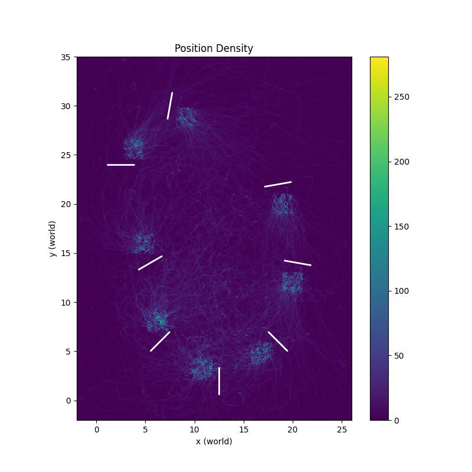
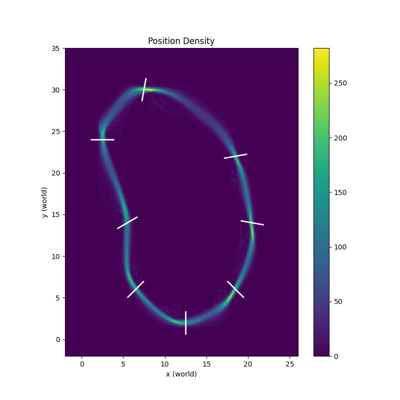
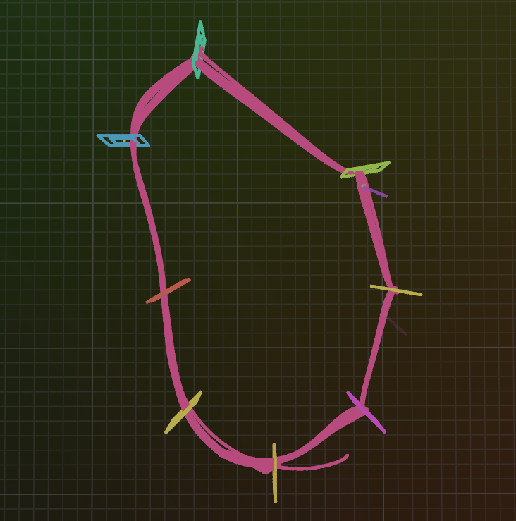
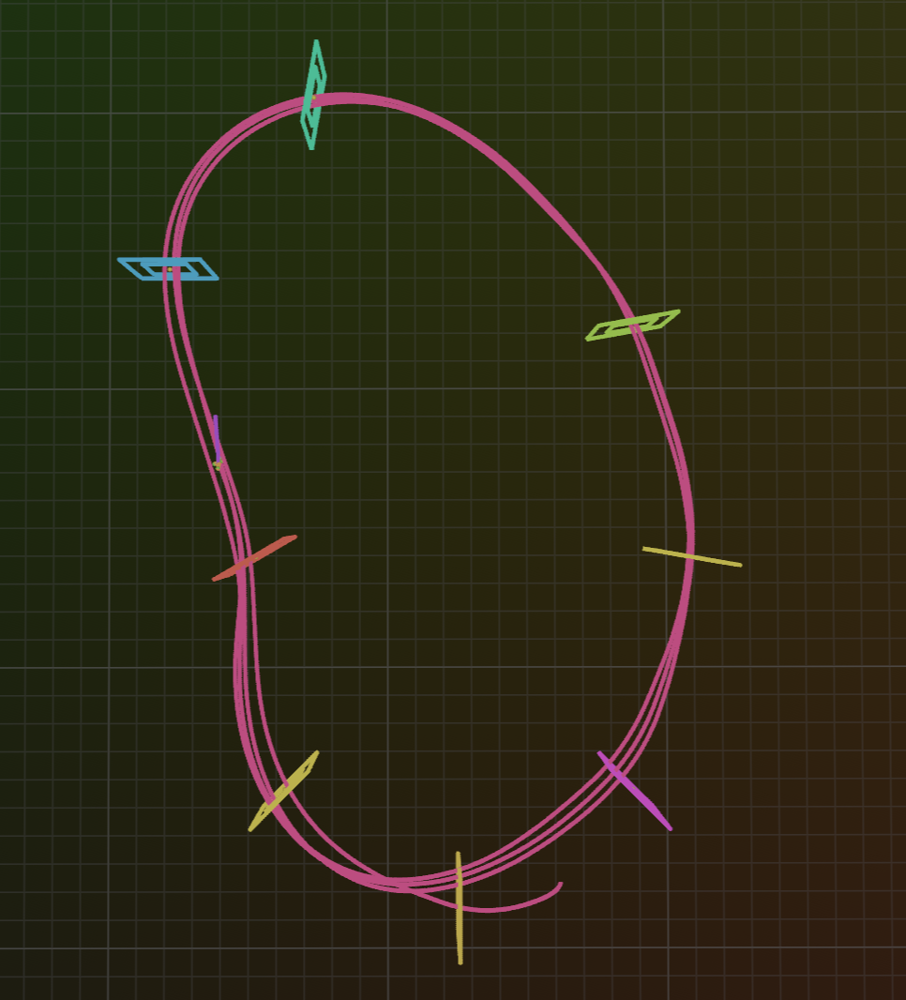

# Drone Racing RL Project

Urban Klobcic (12425725)

Alexander Pichler (12046988)

Alexander Wieser (11809898)

## Task 1: Modeling of Environment Dynamics

### Model

The [model](model.py) is implementing slightly simplified dynamics of the blackbox drone model.
One assumption is, that we can ignore aerodynamic drag. However, this may lead to differences when the drone reaches high velocities. To make this
assumption hold while generating the data, the velocity of the models is reset, once it reaches 20 m/s.
Additionally, the thrust approximation is done under the assumption of purely vertical movement.
The Battery is modeled to decrease by 1 Volt every 60 seconds.

### Identification Procedure

The system identification is done in [acro_excite.py](acro_excite.py) by first exciting the blackbox model with a dirac pulse, steps and a sine wave 
in the range from -1 to 1 for each element of the action commands individually. This model response generation is done in the `excite_model` function,
which can be used on the blackbox or our model.
The blackbox response is then used as reference for fitting the tau values and thrust coefficients.

The tau values for roll, pitch and yaw are fitted using a linear regression approach implemented in the function `fit_tau`.

For thrust coefficient fitting we implemented a least squares algorithm to find fitting coefficients for the given thrust polynomial.
Using the mean tau from the other axes for the thrust tau helped improve the results.
(Sadly, the message on TUWEL, that it's hard to get good results without using scipy's least squares, came too late for us...)

### Validation results

For validation of the results, another set of commands is used that also include a pulse, steps and sine waves with changing frequency for the
different components of the commands.

Plotting the results of exciting the roll, pitch and yaw axis for the blackbox and our model for the validation command sequence results in the 
following diagram:

Plotting the results of exciting thrust for different voltages yields the following diagram:

The **one step prediction mean square error** for these signals is:

|                   | roll       | pitch      | yaw        | thrust      |
|-------------------|------------|------------|------------|-------------|
| MSE Position:     | 0.00000001 | 0.00000001 | 0.00000001 | 0.00000001  |
| MSE Velocity:     | 0.00032150 | 0.00031744 | 0.00030133 | 0.00044554  |
| MSE Acceleration: | 3.21503377 | 3.17442513 | 3.01326990 | 4.45537949  |
| MSE Quaternion:   | 0.00000000 | 0.00000000 | 0.00000000 | 0.00000000  |
| MSE Body Rates:   | 0.00000000 | 0.00000000 | 0.00000000 | 0.00000000  |
| MSE Thrust:       | 9.58668518 | 9.46389008 | 9.03981018 | 13.36613655 |    

Here we can already see, that the acceleration/thrust modelling seems to have issues.
We can see a clear influence of drag even for short simulations, as depicted in the following diagram for a constant thrust command of 1 and all body rates commands set to 0.

Finally, a short 3D trajectory is generated using sine waves on all command axes simultaneously (with different frequencies) to verify that the
overall behaviour is plausible when compared to the blackbox.

### Usage
`python acro_excite.py`
This collects the data from the blackbox for the training/learning and validation/test command sequences and runs the fitting algorithms on the model.
The plots for this report can also be shown by setting the `do_plot` variable to `True`.

## Task 2: Visualization of Rollouts with Rerun

For Task 2, we implemented a visualization tool using the Rerun logging framework to inspect drone racing rollouts in both 3D space and time-synchronized plots.

The core of the implementation is the function `visualize_state_action_sequence(sequence, gates, recording_path, app_id)`, which takes a rollout as a list of state–action pairs `(x, u)` and exports a `.rrd` recording. Each state `x` follows the provided 21-dimensional layout (position, velocity, acceleration, orientation quaternion, angular velocity, previous action, battery voltage), and each action `u` is a 4-dimensional normalized control command.

### Visualization design

The visualization is structured into static and dynamic components:

**Static scene elements (logged once):**
- A world coordinate frame using a right-handed, Z-up convention.
- Racing gate geometry constructed from the provided gate centers and orientations. Each gate is visualized as an outer and inner rectangular loop in 3D space.
- The full drone trajectory, visualized as a polyline connecting all position samples from the rollout.

**Dynamic elements (logged per timestep):**
- The drone pose over time, including motor positions, X-shaped arms, and a forward camera ray, derived from the drone’s position and orientation.
- Time-synchronized scalar plots for key quantities:
  - translational speed,
  - angular speed,
  - individual action components (roll, pitch, yaw, thrust),
  - Euler angles (roll, pitch, yaw).

A discrete time axis (`step`) is used to synchronize all spatial and scalar data, allowing smooth playback and frame-by-frame inspection in the Rerun viewer. An additional continuous time axis (`sim_time`) is logged using the simulator timestep (`dt = 0.01 s`).

### Usage

A small demo script is included via a `__main__` block. It loads an example rollout stored in a `.npy` file, converts it into the required `(x, u)` sequence format, and writes the visualization to `rollout.rrd`. The resulting file can be opened in the Rerun viewer to analyze drone motion, control behavior, and stability over time.

### Purpose

This visualization tool was used extensively to debug and analyze policies in Task 3. In particular, it helped identify issues such as unstable control, incorrect orientation handling, and inefficient gate approaches by correlating 3D trajectories with action and kinematic time-series.

## Task 3: Reinforcement Learning with PPO

### 3.1 Observation Design

An observation is a 31-dimensional vector expressed in the current gate's coordinate frame. It includes:

*   relative position (3D) and velocity (3D) in the current gate frame, scaled by 0.1 to keep magnitudes similar,
*   orientation (3D) relative to the current gate in Euler angles (roll, pitch, yaw) and angular rates (3D),
*   action-history buffer (3 * 4D) with the last 3 control commands, allows policy to infer the current state regardless of delays,
*   battery level (1D), allows policy to account for reduced thrust,
*   relative position of the next gate (3D) in the current gate frame,
*   next gate normal (3D) in the current gate frame. This was added to solve the trajectory planning issue explained in Section 3.5.

To improve robustness, we add noise to position, velocity, orientation, and angular rates.

### 3.2 Reward Design

We use the following for the reward shaping strategy:

*   **Progress Reward:** 1.0 per meter decrease in distance to the current gate between steps.
*   **Gate Bonus**: a large bonus (10.0) when the drone passes through a gate (distance below gate radius and
plane crossing).
*   **Speed Reward:** equal to the norm of the velocity vector scaled by 0.001.
*   **Survival Reward/Penalty:** a constant, small (0.01) penalty per step. Discourages the agent from hovering / looping in the same area. Initially configured as reward, but not necessary since crash penalty is enough to encourage survival.
*   **Altitude Penalty:** equal to the altitude difference between the drone and the current gate scaled by 0.01.
*   **Crash Penalty:** a very large (25.0) penalty when the drone exceeds track bounds in any direction.
*   **Missed Gate Penalty:** a large (10.0) penalty when the drone crosses the gate plane outside the gate radius.
*   **Control Smoothness Penalty:** a penalty proportional equal to the norm of the difference between the current and last command scaled by 0.01. Encourages smoother movement.
*   **Timeout Penalty:** a penalty when the drone exceeds the maximum episode length. Disabled since the agent is already learning to move fast with other rewards.

### 3.3 Network Design

We use a simple actor-critic architecture with:

*   **Structure:** Both networks consist of 2 hidden layers with 512 units each.
*   **Layer Normalization:** We apply `LayerNorm` after input and every hidden layer since our observation space contains mixed magnitudes (e.g., battery voltage 22.0-24.0 vs. Euler angles ~$\pm\pi$).

### 3.4 Training

Training of the PPO agent based on `purejaxrl` is done in a single run of 200M steps. The resulting checkpoint is [ppo_drone_final_submission.ckpt](checkpoints/ppo_drone_final_submission.ckpt), the mlflow run is `PPO_DRONE_FINAL_SUBMISSION`. We use the following hyperparameters:

*   **`LR: 5e-4` with Linear Annealing:** We start with a relatively aggressive learning rate to quickly learn basic stabilization and navigation features. Annealing to 0 ensures convergence in the fine-tuning phase.
*   **`NUM_ENVS: 64`**: Large enough to approximate the true policy gradient, not too large for reasonable training on GPU.
*   **`NUM_STEPS: 1024`**: The rollout length (approx. 10 seconds). Long enough for a full lap, not too long for training on GPU.
*   **`TOTAL_TIMESTEPS: 2e8` (200M)**: Keeps training time reasonable.
*   **`UPDATE_EPOCHS: 4, NUM_MINIBATCHES: 4`**: Defaults from purejaxrl implementation. Keeps size below 6GB VRAM.
*   **`GAMMA: 0.99`**: Discount factor. At 100Hz, $\gamma=0.99$ corresponds to a half-life of $\approx 1$ second.
*   **`GAE_LAMBDA: 0.95`**: Controls the bias-variance trade-off in advantage estimation. Higher values rely too heavily on future returns (noisy at the start of training), random crashes destabilize training. Lower values rely too heavily on the Critic's estimate, which is inaccurate early in training. 
*   **`CLIP_EPS: 0.2`**: Prevents new policy from diverging more than 20% from old policy in a single update. Larger values lead to inconsistency (and defeat the point of PPO), smaller values slow down training.
*   **`ENT_COEF: 0.02`**: Entropy value of 0.02 keeps the policy stochastic enough to explore alternative trajectories (e.g., taking a wider turn). Larger values lead to inconsistency (random crashes), smaller values lead to local optima, like slowing down a lot before a tight turn instead of taking a wider turn.
*   **`VF_COEF: 0.5`**: Scales the Value Function loss relative to the Policy loss. This allows us to control whether to prioritize learning for the Actor or the Critic. Balanced training (0.5) works well.
*   **`MAX_GRAD_NORM: 0.5`**: Prevents spikes in gradients (e.g. from crashes) from destroying the policy.
*   **`ACTIVATION: "relu"`**: Standard ReLU activation function. Could also use `tanh` here, both work similarly well.

The agent first learns to hover and explore randomly. The following density plot with 512 environments generated using `python eval_agent.py --checkpoint checkpoints/ppo_drone_final_submission_step19922944.ckpt` shows this initial exploration after about 20M steps.

Later, the agent learns to move through the gates, but doesn't follow a smooth racing line since the progress reward is maximized by moving toward the next gate in a straight line. The following shows the position density after about 80M steps, generated using `python eval_agent.py --checkpoint checkpoints/ppo_drone_final_submission_step79691776.ckpt`:

Finally, the agent learns an optimal line for the given rewards and increases its speed. The following shows the position density after the full 200M training steps, generated using `python eval_agent.py --checkpoint checkpoints/ppo_drone_final_submission.ckpt`:

### 3.5 Lessons Learned

We encountered several challenges during training, which we discuss below. The unsuccessful attempts are also logged in `mlflow`.

#### Robustness Improvements:

Several of the suggested robustness improvements were implemented. During training, the drone starts slightly after a random gate, aiming for the next gate. The location and orientation have some added noise. 

Observations of position, velocity, orientation, and angular rates also have some added noise.

#### Improved Trajectory Planning using Gate Normals:

Early agents often approached gates at perpendicular angles to the track direction, optimizing for the shortest immediate path (a straight line) rather than a viable racing line. This makes traversing subsequent gates impossible without near-zero velocity turns. This issue is apparent in the heatmap below:

To correct this, we included the normal vector of the upcoming gate in the observation, allowing the agent to plan further ahead and maintain momentum through wider turns.

#### Avoiding Local Optima:

Experiments using positive survival rewards got stuck in a hovering policy, where the agent minimized movement to avoid crash penalties while accumulating survival rewards. To fix this, we added a constant survival penalty. This encourages the agent to complete the course as efficiently as possible to minimize the accumulation of negative reward.

#### Missed Gate Handling:

Initially, we implemented a policy where the agent would be killed if it hit the outer edge of the gate. This made early learning too difficult since the agent avoided the high crash penalty by not moving too close to the gate.

To speed this up, we allowed the agent to travel through the gate plane during training, but penalized missing gates. We did not update the current gate the agent was aiming for if it missed, so it would frequently turn around after missed gate.

To fix this, the agent's current gate is also updated after missing a gate. The missed gate penalty was increased accordingly to prevent cases where the optimal path skips a gate.

The agent would also occasionally cut corners and move through the gate borders. This was fixed by making the gate radius smaller (45cm instead of 75cm) during training. An example of this behavior is shown in the following image:

